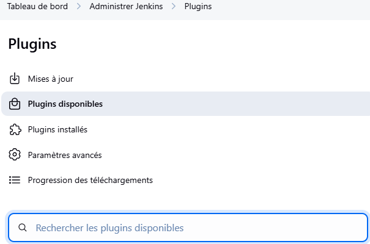
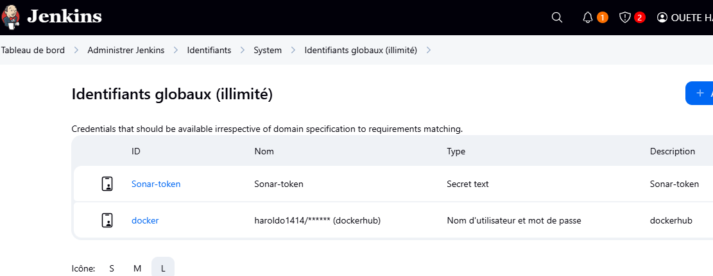

# Mise sur pied Environnement
Creation d'un vagrantfile pour notre machine ubuntu avec 2 cpu et 10Gi de RAM
run VM 
```bash
vagrant up
```
check status VM 
```bash
vagrant status
```

connection a notre VM
```bash
vagrant ssh `pythonWebapp`
```


# INSTALLATION JENKINSS
Mettez à jour le système et installez **Java 17** requis pour Jenkins :
```bash
sudo apt update && sudo apt upgrade -y`
sudo apt install -y fontconfig openjdk-17-jre`
java-version <!-- Vérifier que Java est installé -->

```
```bash
curl -fsSL https://pkg.jenkins.io/debian/jenkins.io-2023.key | sudo tee \
  /usr/share/keyrings/jenkins-keyring.asc > /dev/null
echo "deb [signed-by=/usr/share/keyrings/jenkins-keyring.asc] \
  https://pkg.jenkins.io/debian binary/" | sudo tee \
  /etc/apt/sources.list.d/jenkins.list > /dev/null
```
```bash
sudo apt update
sudo apt install -y jenkins <!-- Installation de Jenkins proprement dit --> 
```
```bash
sudo systemctl enable --now jenkins
sudo systemctl status jenkins
sudo ufw allow 8080/tcp <!--Acceptation des connections entrantes via le port 8080-->
sudo ufw enable
```
```bash
ip addr <!--Identification adresse public de notre VM --> 
```
Via le navigateur ouvrir Jenkins en tapant: 
192.168.56.10:8080
Recuperer mot de passe via:
```bash
sudo cat /var/lib/jenkins/secrets/initialAdminPassword
```


User/Password
admin/admin
OUETE Harold/xxxxxx14@gmail.com


# INSTALLATION DOCKER
```bash
sudo apt-get update
sudo apt-get install docker.io -y
sudo usermod -aG docker $USER
sudo chmod 777 /var/run/docker.sock
```
```bash
sudo docker ps
docker --version
```

Create container for sonar at port 9000
```bash
docker run -d --name sonar -p 9000:9000 sonarqube:lts-community 
```
Acceder a SonarQube via
```bash
192.168.56.10.9000
```


Changement user/password
User/password par defaut
admin/admin
User/password New
admin/admin90


# INSTALLATION TRIVY
```bash
sudo apt-get install wget
apt-transport-https gnupg lsb-release -y
wget -qO - https://aquasecurity.github.io/trivy-repo/deb/public.key | gpg --dearmor | sudo tee /usr/share/keyrings/trivy.gpg > /dev/null
echo "deb [signed-by=/usr/share/keyrings/trivy.gpg] https://aquasecurity.github.io/trivy-repo/deb $(lsb_release -sc) main" | sudo tee -a /etc/apt/sources.list.d/trivy.list
sudo apt-get update
sudo apt-get install trivy -y
```


# INSTALLATION PLUGINS
Ces manipulations se font jenkins
Tableau de bord > Administrer jenkins > Plugins > plugins disponibles

1- OWASP
2- Sonarqube scanner
3- Eclipse Temurin Installer 

Ensuite installation des outils (Tools)
Tableau de bord > Administrer Jenkins > Tools


# CONFIGURATION SONAR SERVER 
Dans Sonar > `192.168.56.10:9000`
Administration > Security > Users > cliquez sur Token and Update Token > Donnez un nom > Generez Token


Copiez le Token 
Allez dans Jenkins
Tableau de Bord > Administrer Jenkins > Identifiants > System > Identifiants globaux


Tableau de bord > Administrer Jenkins > System > SonarQube servers

Tableau de bord > Administrer Kenkins > Tools 


Dans Sonar Administrations > configuration > Webhooks

Dans la section URl renseigner http://192.168.56.10:8080/sonarqube-webhook/ 


Retournons dans Jenkins 
Creer un job 'WebappPython' de type "pipeline" et ajouter ce code [pipeline_script] en prenant la peine de vous arretez a "Fin premiere partie" de ce script(pipeline_script.md)


Lancez Build et observez

Le rapport est visible via notre server Sonarqube


# INSTALLATION PACKAGE MAKE 
```bash
sudo apt install make
make -v
```


# INSTALLATION Docker Image Build and Push
Dans Jenkins
Tableu de bord > Administrer jenkins > Plugins Disponibles 
Docker - Docker commons - Docker Pipeline - Docker API - Docker-Build-Step


Tableau de bord > Administrer Jenkins > Tools


Tableau de bord > Adminitrer Jenkins > Identifiants > System > Identifiants globaux


Ajouter au script de notre pipeline la deuxieme partie de notre [script](pipeline_script.md)

Lancez build


Cette erreur a ete du au faite que l'image construite etait destiner au compte du createur de projet et donc egalement destiner a etre pusher sur son DockerHub


Pour corriger cela j'ai du tout simplement tager l'image de nouveau et specifier mon compte pour destination finale comme vous le verrez ici [text](pipeline_script.md)

Resultat apres Build de nouveau


# DEPLOIEMENT APPLICATION 
```bash
docker run -d --name python1 -p 5000:5000 haroldo1414/python-system-monitoring:latest
```


NB: Se loguer a son compte Docker via sa machine hote (VM dans mon cas)
```bash
docker login
```


Bravo a nous et a tres bientot!